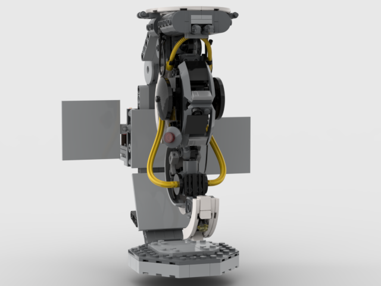
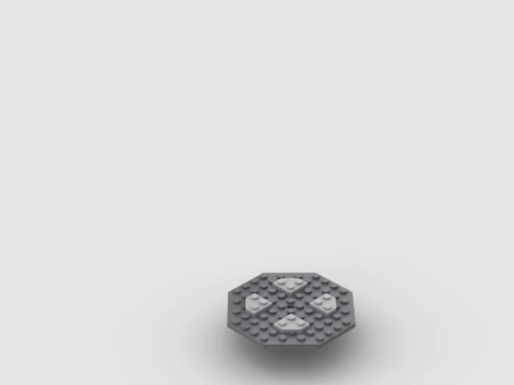

# Lego Ideas Portal 2 Set
Original project:

https://ideas.lego.com/projects/83253ca7-1e0f-4a9d-afff-0de146cd1a16
https://youtu.be/WTcoNlbOjYQ

# Description
This is a (partial) re-creation of the lego ideas portal 2 set in stud.io

# Warnings
* Beware that the since 27965 isn't flexible in stud.io, it's a seperate item which you'll need to connect manually
* Beware that since 73590c02b doesn't exist in stud.io, 73590c02a is used instead, the `parts.xml` has been modified to use the original

# Showcase

